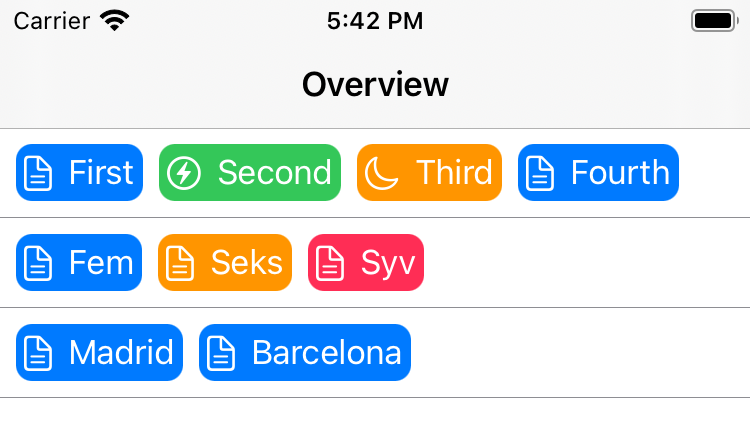
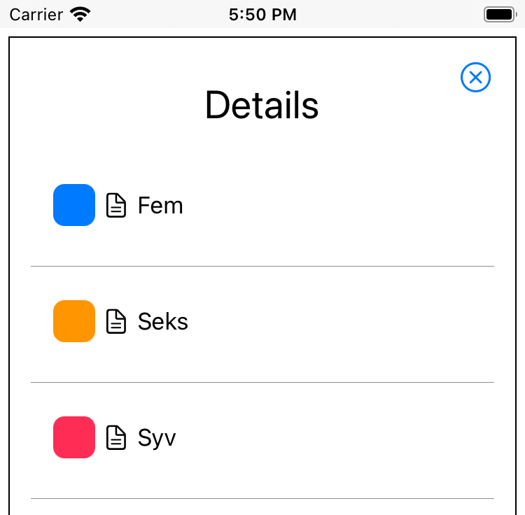

# Swift Matched Geometry Effect PoC

This is a proof of concept SwiftUI project. The purpose is to explore how
matched geometry effect can be used to do a "hero" transition animation between
an overview list and a details view for the selected item.

I wanted to have enough structure in the project to be able to explore some of
the challenges that a real project faces. The resources on SwiftUI animation
that I have been able to find are all squashed together in one Swift file and
this hides some challenges that I am facing in real projects.

Challenges I wanted to explore:
* How to do navigation? What about `NavigationView`?
* How to use `.matchedGeometryEffect` across views that are far away from each
  other in the view hierarchy.
* How to use `@Namespace` in this scenario

This project requires iOS 14 or macOS 11 but has only been tested on an iPhone
simulator. 

## Structure

This project is SwiftUI from the top and uses the new SwiftUI `App` and with a
view called `ContentView` at the top.

The top view has two subviews, `OverviewListView` and `DetailsListView`. The
overview view displays a list of all the top level "lines" and with each line
consisting of a number of items horizontally. The details view show the contents
of one such line with each item on a separate line vertically in what looks like
a traditional table view.

For the purpose of simulating a real project in simples possible way, a few
model classes are defined: `ItemLineModel` and `ItemModel`. The top view,
`ContentView` contains a hard-coded `var` with an array of `ItemLineModel`
instances which each have an array of `ItemModel` instances.

## User Interface

When the app is run, the user sees a list of lines, each with a number of items,
each with its own color, icon and text. 



When a line is tapped, the details view is shown and the same items are shown,
now vertically. A cross in the corner lets the user close the details view and
go back to the overview.



## Navigation – Not Using `NavigationView`

While the overview list view do have a `NavigationView` around it, this is
only to have a navigation bar. Currently it is not possible in SwiftUI to use
`NavigationView` and `NavigationLink` for navigation and at the same time use
custom animations. This might change in a future version of SwiftUI but as it is
now, one have to choose.

Instead, navigation is done by using SwiftUI's ability to have some state and an
`if` statement decide what views are generated and shown. The immediate approach
would be to have one `if` statement (or `switch`) and have the body of
`ContentView` be either overview or details view.

This approach seems to give some problems when combined with the use of
`NavigationView`. That is why I ultimately decided for an approach inspired by
[swiftui-hero-animations](https://github.com/swiftui-lab/swiftui-hero-animations)
from [The SwiftUI Lab](https://swiftui-lab.com).

This approach use a `ZStack` and have the overview list always on screen but
with the details view overlayed when a line is selected.

### Navigation to details

So `ContentView` has a
```
@State var selectedLine: ItemLineModel?
```

and when this is non-nil, the details view is shown in an overlay. The overview
list is passed a binding to `selectedLine` and can thus tell us about it when
the user selects a line.
```
OverviewListView(lines: data,
                  selectedLine: $selectedLine)
```

This is enabled by the following definition in `OverviewListView`:
```
struct OverviewListView: View {
    var lines: [ItemLineModel]
    @Binding var selectedLine: ItemLineModel?

    ...
```

The selection of a line is done by means of a `Button`:
```
Button {
    selectedLine = line
}
label: {
    ...
}
```

Because `selectedLine` is a binding, this sets the `selectedLine` all the way
at the top of the view hierarchy, makes the views rebuild and now the details
view will be shown (see below).

```
if let selectedLine = selectedLine {
    Color.white.overlay(
        DetailsListView(items: selectedLine.items,
                        selectedLine: $selectedLine)
    )
}
```

### Navigation back to overview

As can be seen above, the state is also passed on the the details view as a
binding and when the close button is tapped, the `var` is changed back to nil
and thus the overlay with the details view is removed again.

```
Button {
    selectedLine = nil
}
label: {
    Icons.xmark_circle.imageScale(.large)
}
```

# Animations!

The primary goal for my explorations was animations, so let us add some of
those. 

## Overview

First, the overview consist of `OverviewListView` that contains a
`VStack` of all lines, each with a `OverviewCellView`. Each of those consists of
a `HStack` with all the items, each shown with an `OverviewItemView`.

An `OverviewItemView` contains an icon, a text and a colored `RoundedRectangle`
as background.

```
var body: some View {
    HStack {
        item.icon
        Text(item.text)
    }
    .padding(4)
    .background(RoundedRectangle(cornerRadius: 8)
                    .foregroundColor(item.color)
    )
    .foregroundColor(Color.white)
}
```

## Details

The details view consists of `DetailsListView` that have a `VStack` of all
items, with each item displayed by a `DetailsListCellView`. Here we again have
the same icon, text and colored `RoundedRectangle`, although here the colored
`RoundedRectangle` is not background but as separate element in a `HStack` with
the icon and the text.

```
HStack {
    RoundedRectangle(cornerRadius: 8)
        .foregroundColor(item.color)
        .frame(width: 30, height: 30)
    item.icon
    Text(item.text)
    Spacer()
}
.padding()
```

## Matched Geometry Effect

Next step is to ensure the elements of the overview view is matched with the
corresponding elements in the details view. This is done with
`.matchedGeometryEffect` view modifier. The overview contains more than one
line, all with the same elements so we need to ensure the right elements are
matched. 

This is done by using the item id as part of the `id` parameter to
`.matchedGeometryEffect`. So both in the overview and in the details, the
rounded rectangle is given this string as id: 
```
"\(item.id).color"
```

Similarly for the other elements.

Now yhe `OverviewItemView` ends up like this:
```
var body: some View {
    HStack {
        item.icon
            .matchedGeometryEffect(id: "\(item.id).icon", in: lineAnimation)
            
        Text(item.text)
            .matchedGeometryEffect(id: "\(item.id).text", in: lineAnimation)
    }
    .padding(4)
    .background(RoundedRectangle(cornerRadius: 8)
                    .matchedGeometryEffect(id: "\(item.id).color", in: lineAnimation)
                    .foregroundColor(item.color)
    )
    .foregroundColor(Color.white)
}
```

and the final `DetailsListCellView` has this body:
```
var body: some View {
    VStack {
        HStack {
            RoundedRectangle(cornerRadius: 8)
                .matchedGeometryEffect(id: "\(item.id).color", in: lineAnimation)
                .foregroundColor(item.color)
                .frame(width: 30, height: 30)

            item.icon
                .matchedGeometryEffect(id: "\(item.id).icon", in: lineAnimation)
            Text(item.text)
                .matchedGeometryEffect(id: "\(item.id).text", in: lineAnimation)
            Spacer()
        }
        .padding()
        Hairline()
    }
}
```

## Namespace

The second parameter for `.matchedGeometryEffect` is a namespace. This namespace
must match for the animation to work. The solution I could find for this is to
have it declared at the top level, `ContentView` in our case:
```
@Namespace var lineAnimation
```
and then pass it on to the sub-views like this:
```
OverviewListView(lines: data,
                  selectedLine: $selectedLine,
                  lineAnimation: lineAnimation)
```
with the following declation to receive the value:
```
struct OverviewListView: View {
    var lines: [ItemLineModel]
    @Binding var selectedLine: ItemLineModel?
    var lineAnimation: Namespace.ID
    ...
```
the value is passed on to the sub-views and they all use the same declaration.

## withAnimation

To trigger the animations, it is necessary to wrap state changes in
`withAnimation`. This means that the `Button` declaration in the overview cell
becomes:
```
Button {
    withAnimation {
        selectedLine = line
    }
}
label: {
    ...
}    
```

## Must Disappear

An important aspect when `.matchedGeometryEffect` is used, is that SwiftUI
expects to have only 1 view with each `id` at any given time. If you show either
view A or view B (e.g. with a `if` statement),